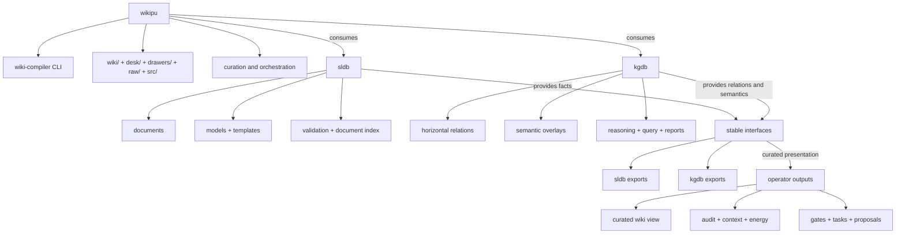

# kgdb Target Architecture Diagram

This deferred diagram shows the intended future split where `wikipu` curates two external layers: `sldb` for document facts and indexing, and `kgdb` for horizontal relations and semantic interpretation.

## Context

This is not current truth. It is a target-state architecture aid for the `kgdb` isolation effort and should stay in `drawers/` until the split is implemented.

## Source

- Spec source: `drawers/diagrams/specs/kgdb_target_architecture.yml`
- Rendered Mermaid: `drawers/diagrams/rendered/kgdb_target_architecture.mmd`
- Rendered PlantUML: `drawers/diagrams/rendered/kgdb_target_architecture.puml`

## Diagram

## What this target makes explicit

- `wikipu` is the curator, not the owner of document indexing or relation semantics
- `sldb` owns facts, document structure, and indexing
- `kgdb` owns horizontal relations, semantic interpretation, and graph-native outputs
- the future split depends on stable interfaces between the three systems

## Usage Examples

- Use this diagram when discussing the desired end state of the three-library split.
- Compare it with `wiki/reference/diagrams/current_system_architecture.md` to explain what is changing.
