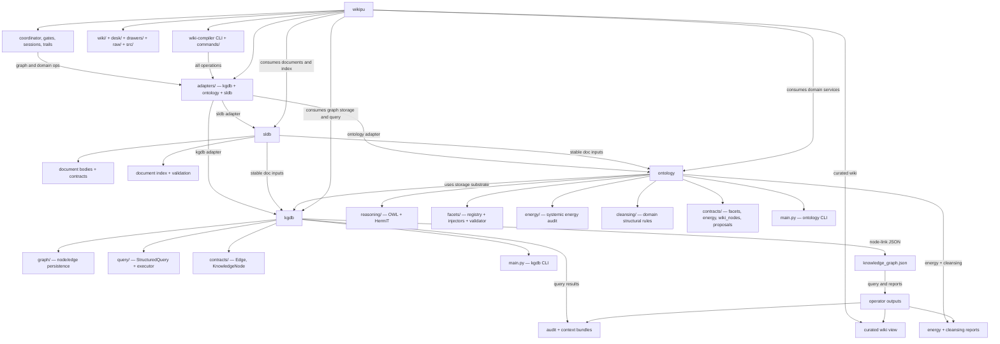

# Target Architecture Diagram — kgdb + ontology + wikipu

This deferred diagram shows the intended future state where `wikipu` curates three external layers: `sldb` for document facts, `kgdb` for pure graph database operations, and `ontology` for domain knowledge and semantic interpretation.

## Context

This is not current truth. It is the target-state architecture that the extraction plan in `drawers/executable-extraction-plan.md` is designed to reach. It should stay in `drawers/` until the split is fully implemented.

Compare with `wiki/reference/diagrams/current_system_architecture.md` to see what is changing.

## Source

- Spec source: `drawers/diagrams/specs/target_architecture.yml`
- Rendered Mermaid: `drawers/diagrams/rendered/target_architecture.mmd`
- Rendered PlantUML: `drawers/diagrams/rendered/target_architecture.puml`

## Diagram

## What this target makes explicit

- `kgdb` is a pure database — no OWL, no facet semantics, no domain rules
- `ontology` is the domain knowledge layer — it uses `kgdb` as its storage substrate, never the other way
- `Adapters` inside `wikipu` is the only crossing point — `CuratorCLI` and `CurationFlows` never import kgdb or ontology internals directly
- `sldb` feeds both `kgdb` and `ontology` through stable document artifact inputs
- Each of the three new packages has its own CLI (`main.py`)

## Usage Examples

- Use this diagram when discussing the desired end state of the three-package split.
- Use it alongside `drawers/executable-extraction-plan.md` to track which phases have been completed.
- Compare against `wiki/reference/diagrams/current_system_architecture.md` to explain what is changing.
