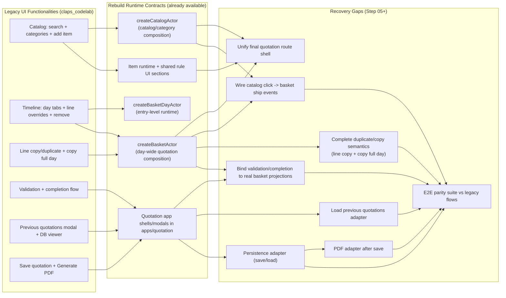

# Legacy Functionality Recovery Mapping

Purpose: recover the legacy `claps_codelab` quotation UX functionality on top of the rebuild runtime stack, without reintroducing business logic into Alpine/UI.

## Recovery Graph

## Target Runtime Stack (Rebuild)

- Catalog composition: `packages/components/catalog/machine/catalogMachine.js`
- Basket single day: `packages/components/basket-day/machine/basketDayMachine.js`
- Basket by days: `packages/components/basket/machine/basketMachine.js`
- Item runtime/rules/pricing: `packages/components/item/**`

## Functional Parity Matrix

| Legacy capability | Legacy source | Rebuild target contract | Status | Remaining work |
|---|---|---|---|---|
| Browse/start flow (new, load previous, DB viewer) | `packages/frontend/Index.html` | App shell + quotation flow state in `apps/quotation/**` | Partial | Wire real basket/catalog runtime into quotation flow shell.
| Client selector modal + create client | `Components_ModalCliente.html` | `packages/components/quotation/modals/ClientSelector*` | Partial | Connect to real store/API adapter in rebuild flow.
| Catalog grouped by category + search | `Components_Sidebar.html` | `createCatalogActor` + sandbox route `/step-I3-category-02` | Done (sandbox) | Embed this catalog projection in final Step 05 layout.
| Expand/collapse category lifecycle | `Components_Sidebar.html` (details accordion) | `TOGGLE_CATEGORY`, `EXPAND_CATEGORY`, `COLLAPSE_CATEGORY` | Done | Keep exact behavior in final route.
| Item rule hover indicator | sidebar/timeline cards | Shared sections `playgroundItemSections.js` + item state rules | Done | Keep shared template in final UI to avoid drift.
| Add item from catalog to basket | `agregarItem()` in `Stores_XStateApp.html` | `SHIP_SELECTED_ITEM` / `SHIP_ITEM_TO_DAY` on `basketMachine` | Partial | Connect catalog item click to basket actor event bridge.
| Day tabs + per-day filtering | `Components_Timeline.html` | `SELECT_DAY` + `state.selectedDayState` in `basketMachine` | Done | Style/placement alignment in Step 05 shell.
| Per-line overrides (pax/units/duration/time/comment) | `actualizar*` methods in `Stores_XStateApp.html` | `SET_ENTRY_OVERRIDE`, `CLEAR_ENTRY_OVERRIDE`, `RESET_ENTRY_OVERRIDES` | Done (runtime) | Complete final UI bindings for all fields.
| Remove line | `eliminarItem()` | `REMOVE_ENTRY` (day-aware in basket machine) | Done | Maintain entryId-only targeting.
| Duplicate line in same day | `duplicarItemEnDia()` | `SHIP_ITEM_TO_DAY` with same day + optional override copy | Partial | Add dedicated duplicate action in final shell.
| Copy line to next day | `copiarItemAlDiaSiguiente()` | `MOVE_ENTRY_TO_DAY` or ship+override clone | Partial | Add explicit copy-vs-move semantics in UI.
| Copy full day to next day | `copiarDiaCompletoAlSiguiente()` | batch `SHIP_ITEM_TO_DAY` with override cloning | Missing | Implement batch command at basket orchestration/UI layer.
| Move entry between days | timeline workflow | `MOVE_ENTRY_TO_DAY` in `basketMachine` | Done | Add drag/drop or action UX in final route.
| Basket/day aggregates | timeline + summary bar | `basketMachine.state.summary` + day projections | Partial | Restore full totals panel and formatting in Step 05.
| Validation screen (review + confirm/back) | `Components_ValidationSummary.html` | quotation app stage + basket snapshot projection | Partial | Bind to rebuild basket projections and save action.
| Completion screen | `Components_CompletionSuccess.html` | quotation app completed stage | Partial | Connect to real save response payload.
| Previous quotations modal + filters + load | `Components_ModalCotizaciones.html` | quotation app modal + data service | Partial | Implement load/list adapters on rebuild side.
| Database viewer modal | `Components_DatabaseViewer.html` | `packages/components/quotation/modals/databaseViewer*` + DB adapter | Partial | Connect to active data source in final app route.
| Save quotation | `guardarCotizacion()` / `confirmarYGuardar()` | quotation app command -> persistence adapter | Missing | Implement persistence integration endpoint in rebuild flow.
| Generate PDF | `generarPDF()` | post-save action in app service layer | Missing | Implement PDF service adapter and action wiring.

## Event Mapping (Legacy -> Rebuild)

- `agregarItem(item)` -> `basket.send({ type: 'SHIP_ITEM_TO_DAY', dayIndex, itemId })`
- `actualizarCantidad/Unidades/Duracion/Hora/Comentario` -> `SET_ENTRY_OVERRIDE` per key
- clear field -> `CLEAR_ENTRY_OVERRIDE`
- reset line -> `RESET_ENTRY_OVERRIDES`
- `eliminarItem` -> `REMOVE_ENTRY`
- day tab click -> `SELECT_DAY`
- global pax/hour/duration changes -> `SET_CONTEXT`
- move entry day -> `MOVE_ENTRY_TO_DAY`

## Recovery Scope Left (High Level)

1. Step 05 full planned layout integration (shell + panel composition).
2. End-to-end wiring: catalog selection -> basket actor shipping in one route.
3. Batch day operations parity (copy whole day, duplicate/copy semantics).
4. App-level workflow parity (validation/completion, previous quotations, DB viewer).
5. External services parity (save/load quotation and PDF generation adapters).

## Definition of Recovered State

Legacy functionality is considered recovered when:

- every interaction in the legacy UI has a mapped command in the rebuild route,
- no pricing/rules logic is duplicated in UI handlers,
- entry identity (`entryId`) remains the mutation boundary,
- parity flows (catalog -> basket -> validation -> completion) pass manual and automated checks.
