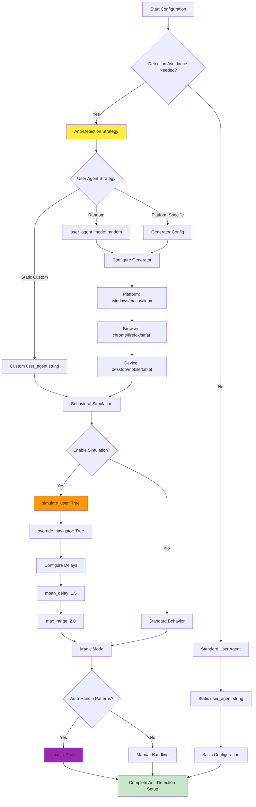
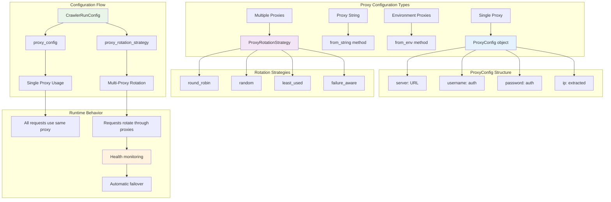
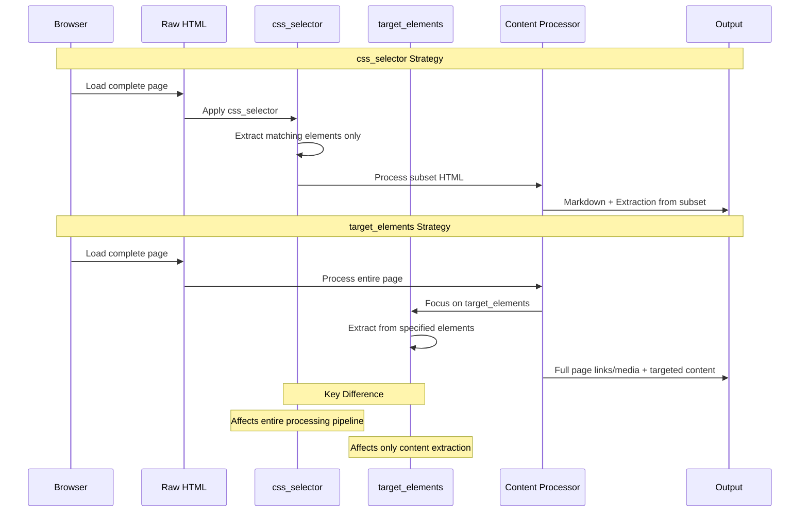
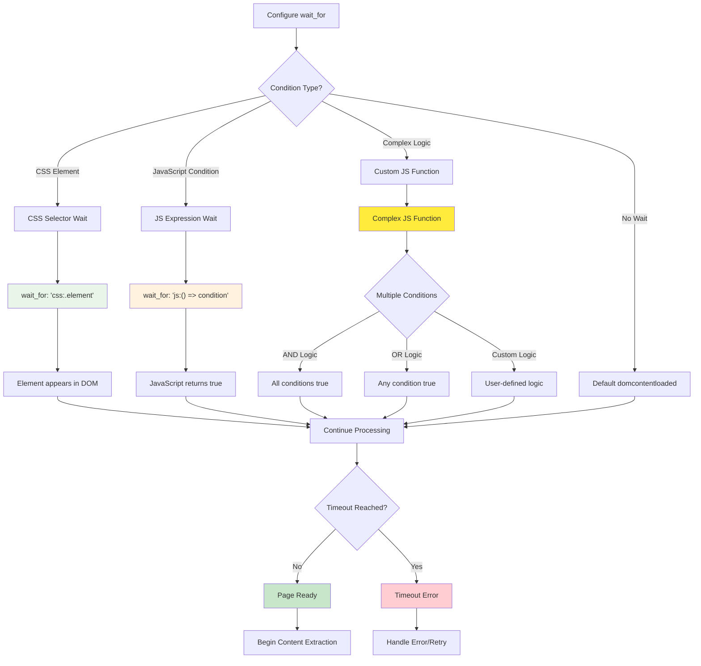
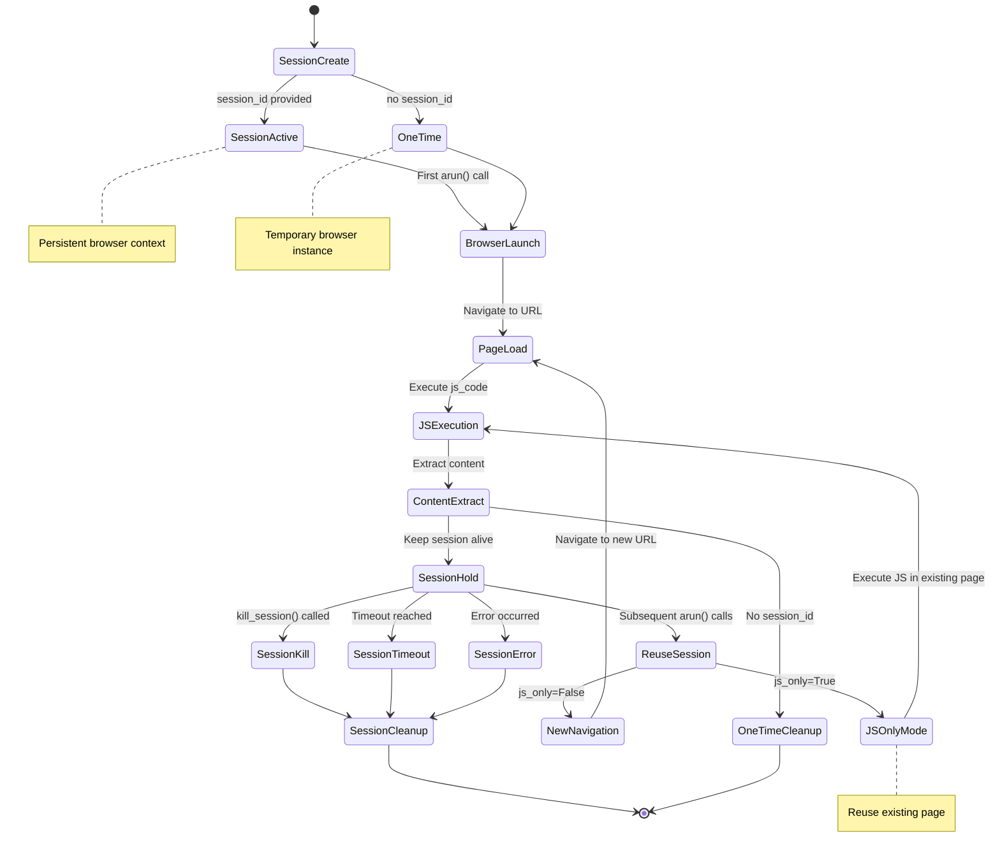
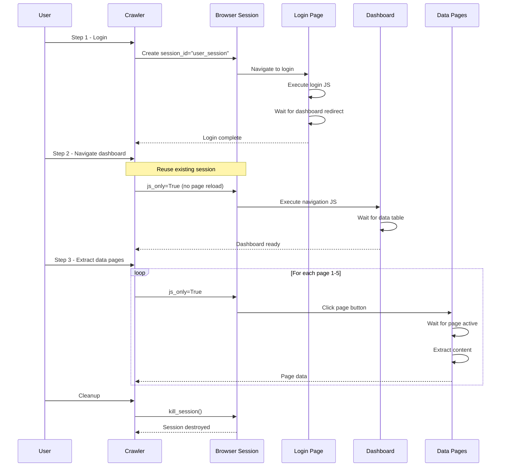
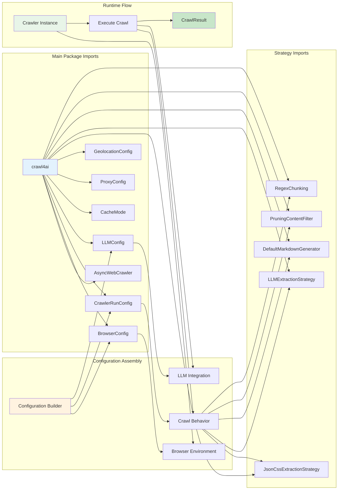

---
identity:
  node_id: "doc:wiki/drafts/advanced_configuration_workflows_and_patterns.md"
  node_type: "concept"
edges:
  - {target_id: "raw:raw/docs_postulador_refactor/future_docs/crawl4ai_custom_context (1).md", relation_type: "documents"}
---

Visual representations of advanced Crawl4AI configuration strategies, proxy management, session handling, and identity-based crawling patterns.

## Details

Visual representations of advanced Crawl4AI configuration strategies, proxy management, session handling, and identity-based crawling patterns.

### User Agent and Anti-Detection Strategy Flow

### Proxy Configuration and Rotation Architecture

### Content Selection Strategy Comparison

### Advanced wait_for Conditions Decision Tree

### Session Management Lifecycle

### Identity-Based Crawling Configuration Matrix

```mermaid
graph TD
    subgraph "Geographic Identity"
        A[Geolocation] --> A1[latitude/longitude]
        A2[Timezone] --> A3[timezone_id]
        A4[Locale] --> A5[language/region]
    end
    
    subgraph "Browser Identity"
        B[User Agent] --> B1[Platform fingerprint]
        B2[Navigator Properties] --> B3[override_navigator]
        B4[Headers] --> B5[Accept-Language]
    end
    
    subgraph "Behavioral Identity"
        C[Mouse Simulation] --> C1[simulate_user]
        C2[Timing Patterns] --> C3[mean_delay/max_range]
        C4[Interaction Patterns] --> C5[Human-like behavior]
    end
    
    subgraph "Configuration Integration"
        D[CrawlerRunConfig] --> A
        D --> B
        D --> C
        
        D --> E[Complete Identity Profile]
        
        E --> F[Geographic Consistency]
        E --> G[Browser Consistency]
        E --> H[Behavioral Consistency]
    end
    
    F --> I[Paris, France Example]
    I --> I1[locale: fr-FR]
    I --> I2[timezone: Europe/Paris]
    I --> I3[geolocation: 48.8566, 2.3522]
    
    G --> J[Windows Chrome Example]
    J --> J1[platform: windows]
    J --> J2[browser: chrome]
    J --> J3[user_agent: matching pattern]
    
    H --> K[Human Simulation]
    K --> K1[Random delays]
    K --> K2[Mouse movements]
    K --> K3[Navigation patterns]
    
    style E fill:#ff9800
    style I fill:#e3f2fd
    style J fill:#f3e5f5
    style K fill:#e8f5e8
```

### Multi-Step Crawling Sequence Flow

### Configuration Import and Usage Patterns

### Advanced Configuration Decision Matrix

```mermaid
flowchart TD
    A[Advanced Configuration Needed] --> B{Primary Use Case?}
    
    B -->|Bot Detection Avoidance| C[Anti-Detection Setup]
    B -->|Geographic Simulation| D[Identity-Based Config]
    B -->|Multi-Step Workflows| E[Session Management]
    B -->|Network Reliability| F[Proxy Configuration]
    B -->|Content Precision| G[Selector Strategy]
    
    C --> C1[Random User Agents]
    C --> C2[Behavioral Simulation]
    C --> C3[Navigator Override]
    C --> C4[Magic Mode]
    
    D --> D1[Geolocation Setup]
    D --> D2[Locale Configuration]
    D --> D3[Timezone Setting]
    D --> D4[Browser Fingerprinting]
    
    E --> E1[Session ID Management]
    E --> E2[JS-Only Navigation]
    E --> E3[Shared Data Context]
    E --> E4[Session Cleanup]
    
    F --> F1[Single Proxy]
    F --> F2[Proxy Rotation]
    F --> F3[Failover Strategy]
    F --> F4[Health Monitoring]
    
    G --> G1[css_selector for Subset]
    G --> G2[target_elements for Focus]
    G --> G3[excluded_selector for Removal]
    G --> G4[Hierarchical Selection]
    
    C1 --> H[Production Configuration]
    C2 --> H
    C3 --> H
    C4 --> H
    D1 --> H
    D2 --> H
    D3 --> H
    D4 --> H
    E1 --> H
    E2 --> H
    E3 --> H
    E4 --> H
    F1 --> H
    F2 --> H
    F3 --> H
    F4 --> H
    G1 --> H
    G2 --> H
    G3 --> H
    G4 --> H
    
    style H fill:#c8e6c9
    style C fill:#ff9800
    style D fill:#9c27b0
    style E fill:#2196f3
    style F fill:#4caf50
    style G fill:#ff5722
```

Generated from `raw/docs_postulador_refactor/future_docs/crawl4ai_custom_context (1).md`.