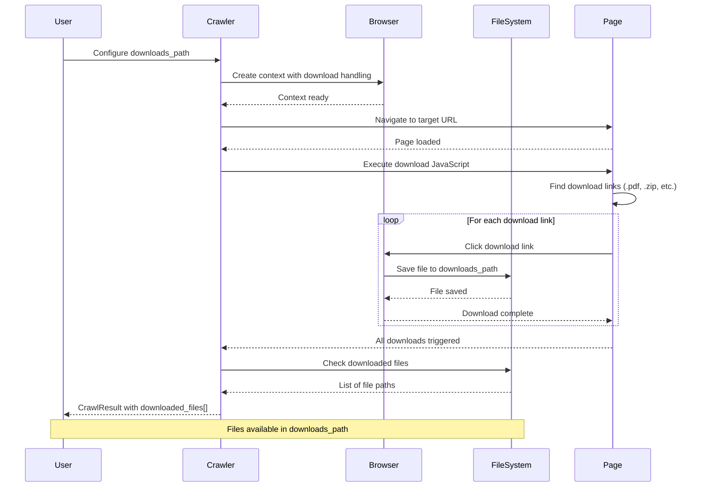
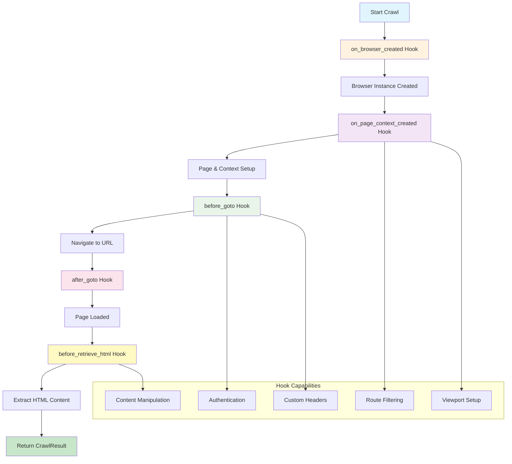
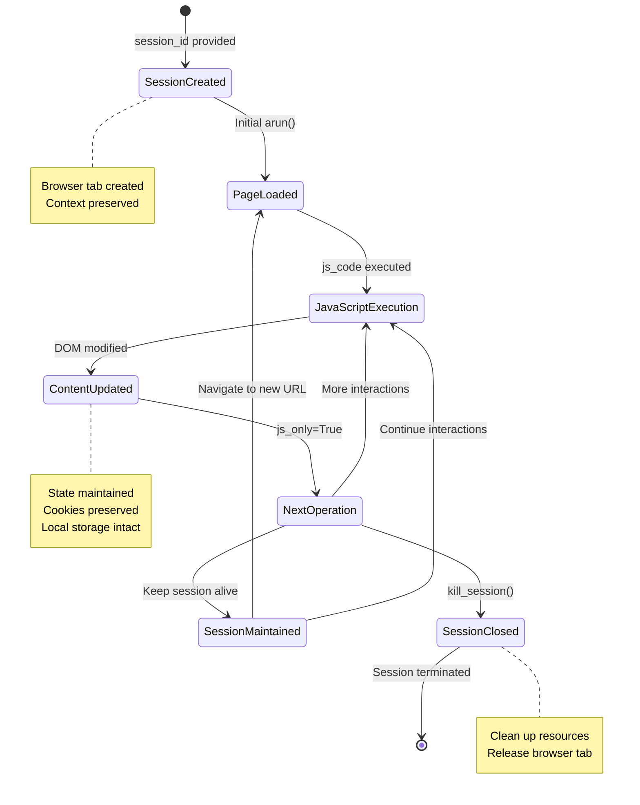
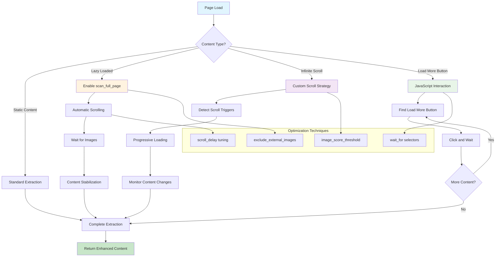
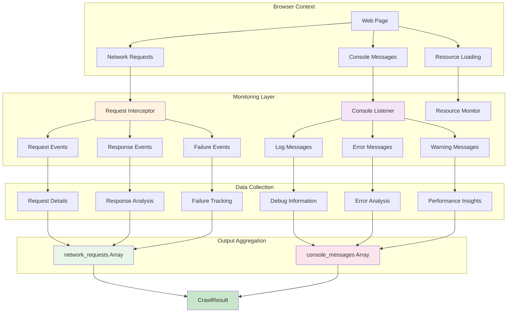
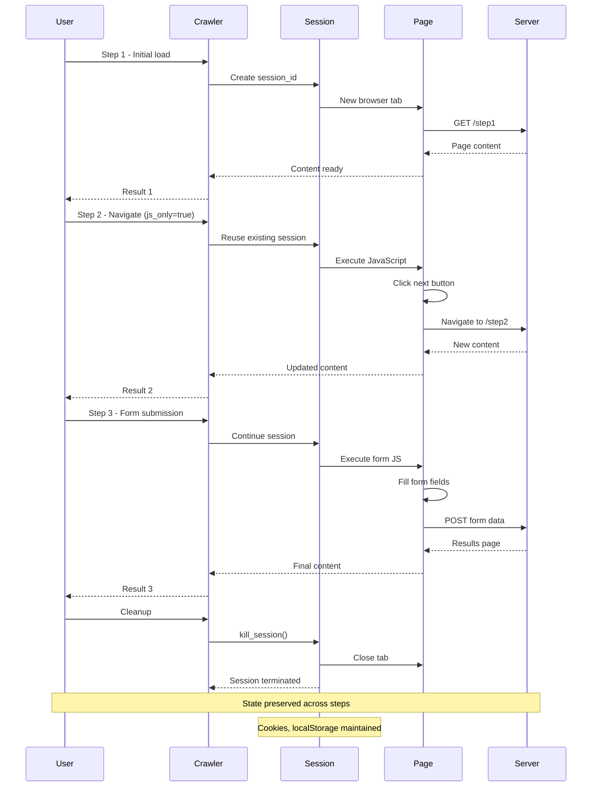
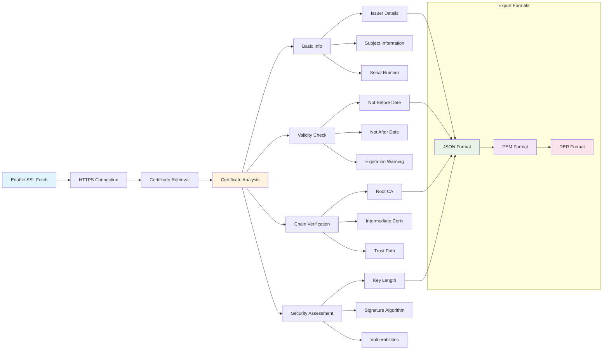
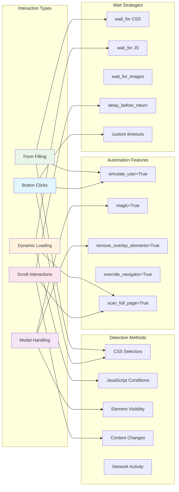
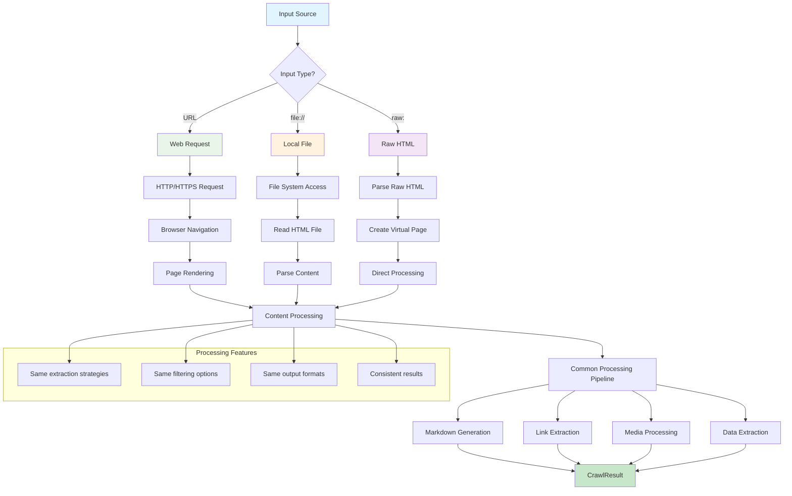

---
identity:
  node_id: "doc:wiki/drafts/advanced_features_workflows_and_architecture.md"
  node_type: "concept"
edges:
  - {target_id: "raw:raw/docs_postulador_refactor/future_docs/crawl4ai_custom_context (1).md", relation_type: "documents"}
---

Visual representations of advanced crawling capabilities, session management, hooks system, and performance optimization strategies.

## Details

Visual representations of advanced crawling capabilities, session management, hooks system, and performance optimization strategies.

### File Download Workflow



### Hooks Execution Flow



### Session Management State Machine



### Lazy Loading & Dynamic Content Strategy



### Network & Console Monitoring Architecture



### Multi-Step Workflow Sequence



### SSL Certificate Analysis Flow



### Performance Optimization Decision Tree

```mermaid
flowchart TD
    A[Performance Optimization] --> B{Primary Goal?}
    
    B -->|Speed| C[Fast Crawling Mode]
    B -->|Resource Usage| D[Memory Optimization]
    B -->|Scale| E[Batch Processing]
    B -->|Quality| F[Comprehensive Extraction]
    
    C --> C1[text_mode=True]
    C --> C2[exclude_all_images=True]
    C --> C3[excluded_tags=['script','style']]
    C --> C4[page_timeout=30000]
    
    D --> D1[light_mode=True]
    D --> D2[headless=True]
    D --> D3[semaphore_count=3]
    D --> D4[disable monitoring]
    
    E --> E1[stream=True]
    E --> E2[cache_mode=ENABLED]
    E --> E3[arun_many()]
    E --> E4[concurrent batches]
    
    F --> F1[wait_for_images=True]
    F --> F2[process_iframes=True]
    F --> F3[capture_network=True]
    F --> F4[screenshot=True]
    
    subgraph "Trade-offs"
        G[Speed vs Quality]
        H[Memory vs Features]
        I[Scale vs Detail]
    end
    
    C --> G
    D --> H
    E --> I
    
    subgraph "Monitoring Metrics"
        J[Response Time]
        K[Memory Usage]
        L[Success Rate]
        M[Content Quality]
    end
    
    C1 --> J
    D1 --> K
    E1 --> L
    F1 --> M
    
    style A fill:#e1f5fe
    style C fill:#e8f5e8
    style D fill:#fff3e0
    style E fill:#f3e5f5
    style F fill:#fce4ec
```

### Advanced Page Interaction Matrix



### Input Source Processing Flow



**📖 Learn more:** [Advanced Features Guide](https://docs.crawl4ai.com/advanced/advanced-features/), [Session Management](https://docs.crawl4ai.com/advanced/session-management/), [Hooks System](https://docs.crawl4ai.com/advanced/hooks-auth/), [Performance Optimization](https://docs.crawl4ai.com/advanced/performance/)

**📖 Learn more:** [Identity-Based Crawling](https://docs.crawl4ai.com/advanced/identity-based-crawling/), [Session Management](https://docs.crawl4ai.com/advanced/session-management/), [Proxy & Security](https://docs.crawl4ai.com/advanced/proxy-security/), [Content Selection](https://docs.crawl4ai.com/core/content-selection/)

**📖 Learn more:** [Configuration Reference](https://docs.crawl4ai.com/api/parameters/), [Best Practices](https://docs.crawl4ai.com/core/browser-crawler-config/), [Advanced Configuration](https://docs.crawl4ai.com/advanced/advanced-features/)

---

Generated from `raw/docs_postulador_refactor/future_docs/crawl4ai_custom_context (1).md`.