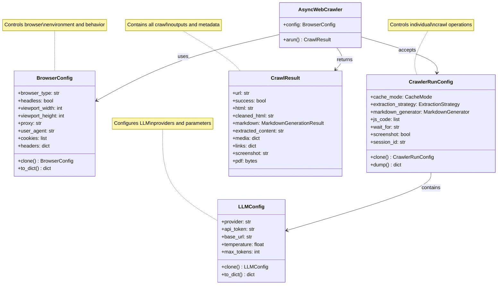
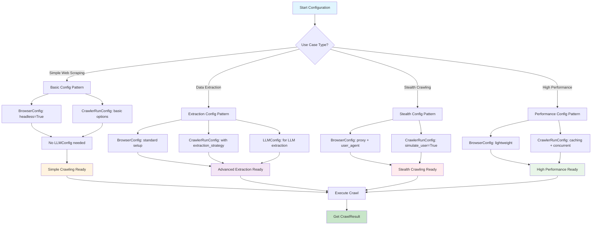
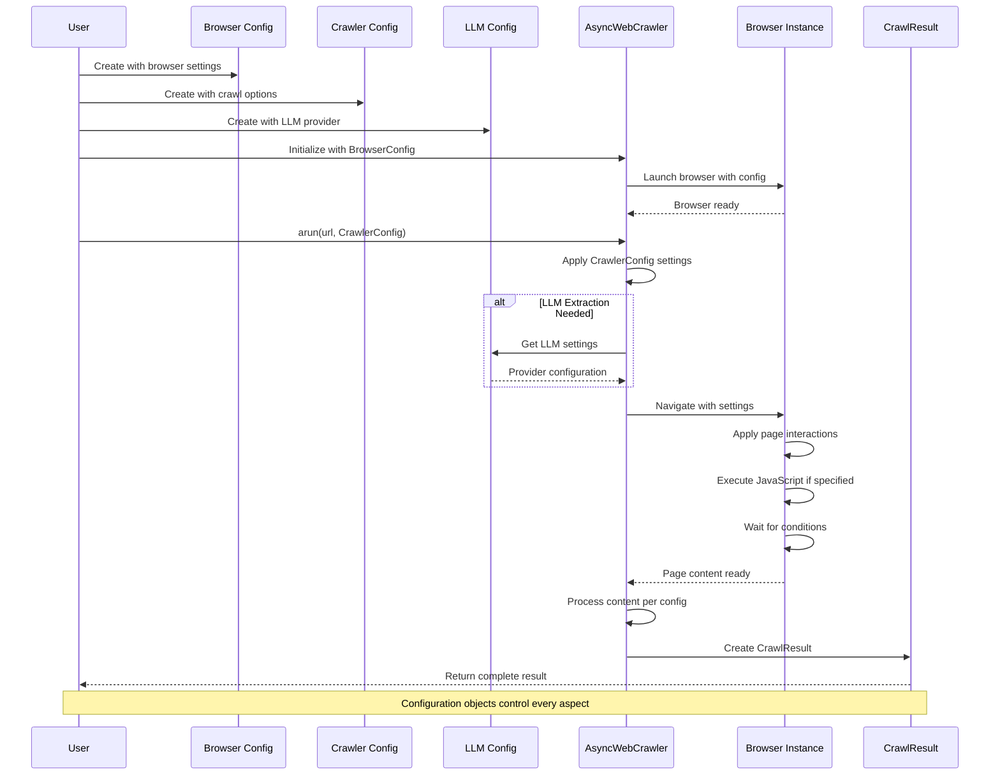
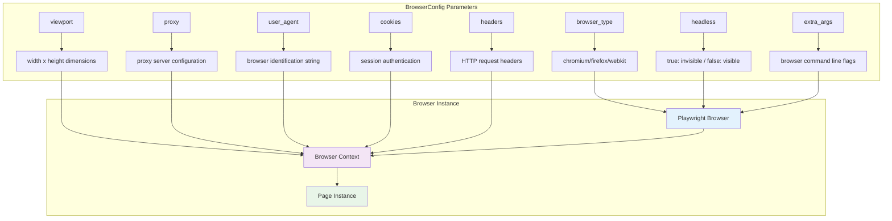
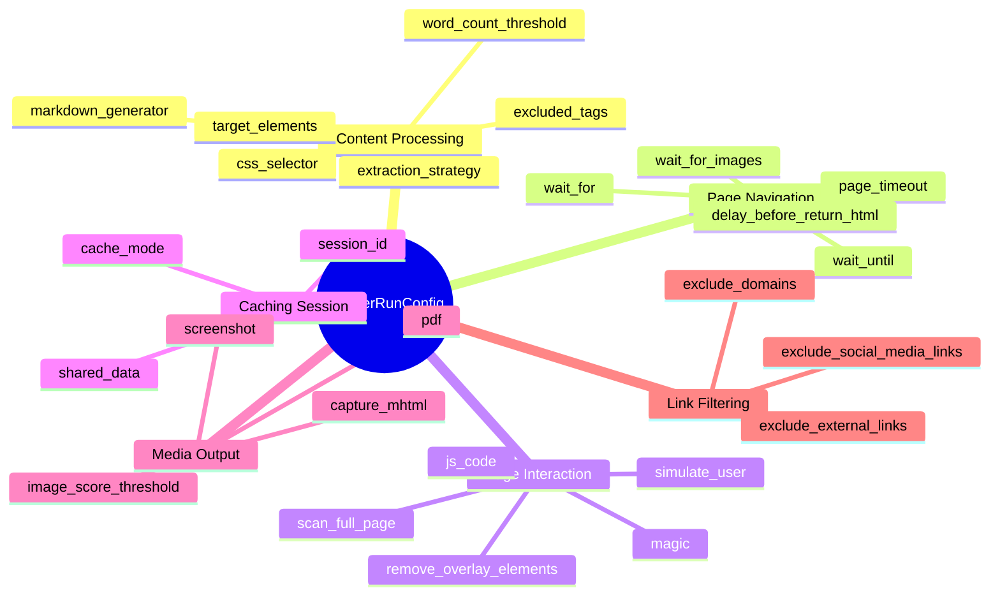
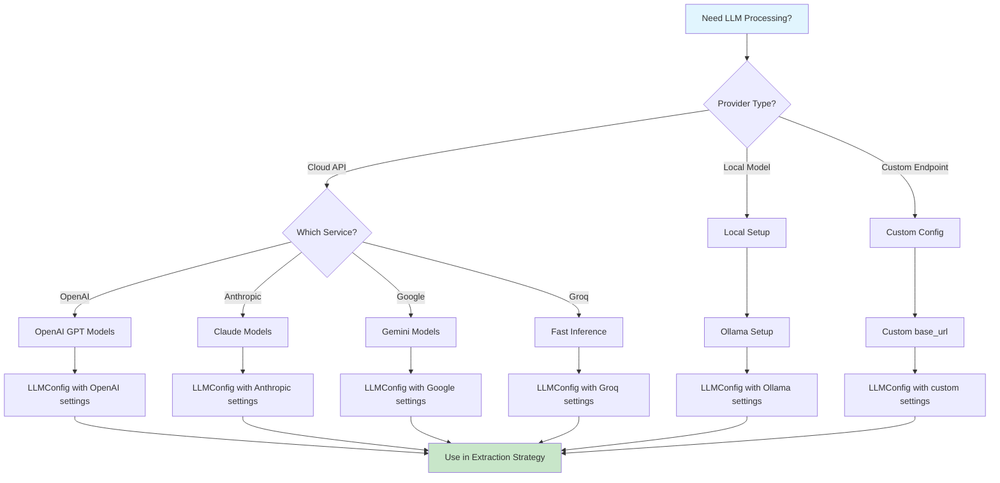
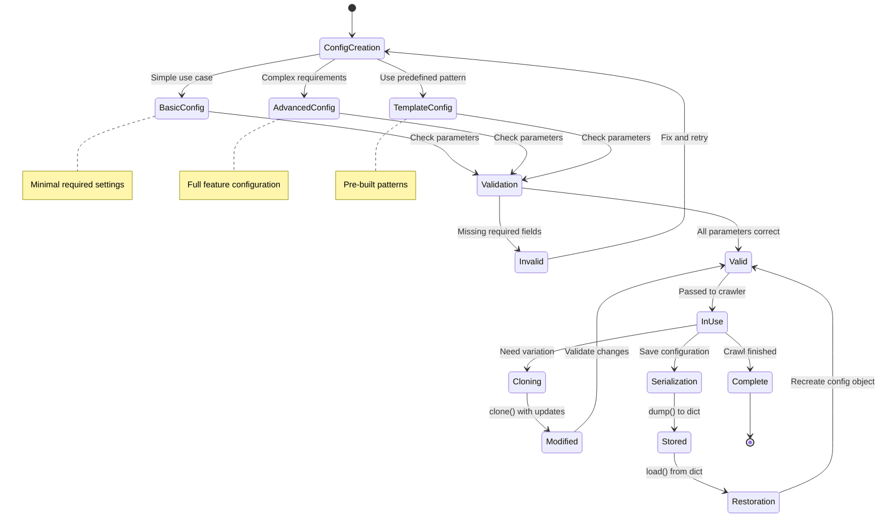
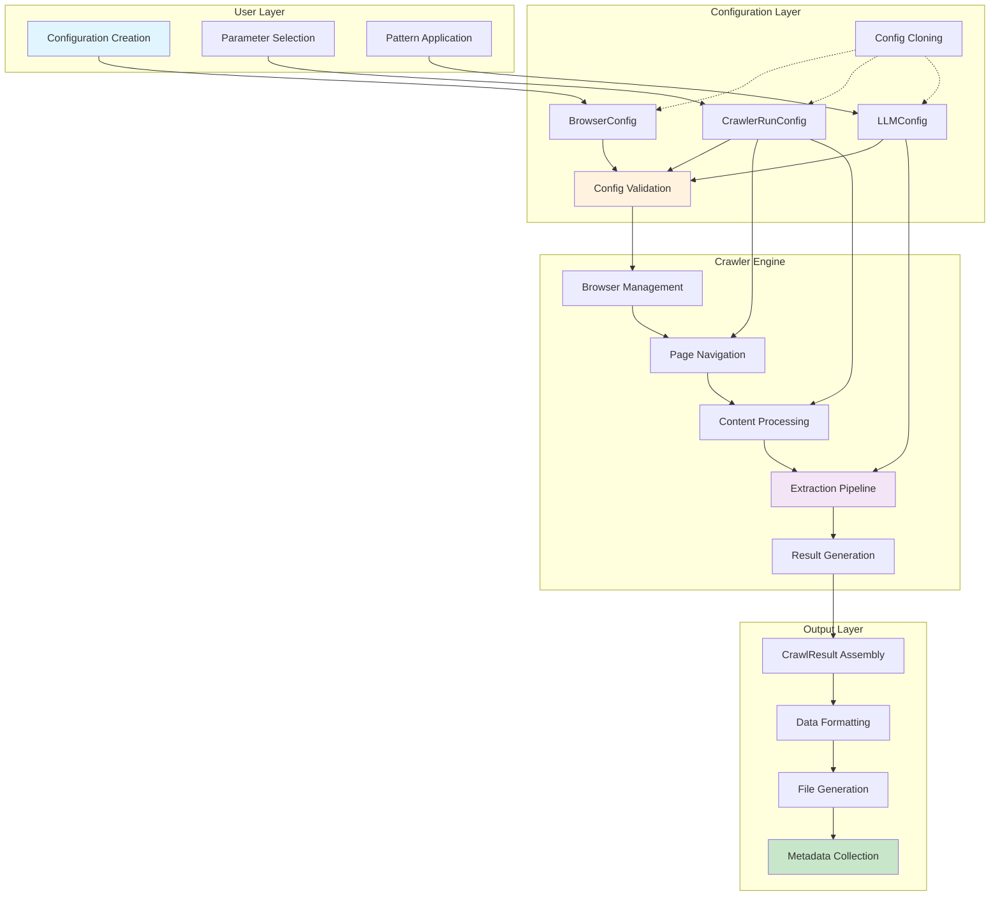
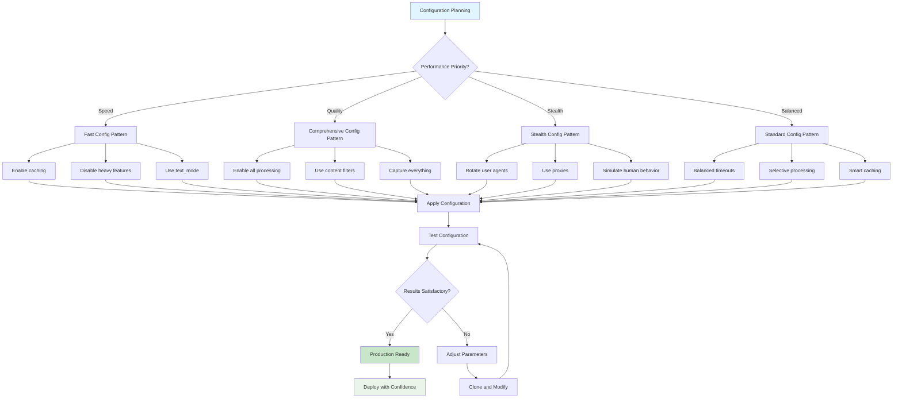

---
identity:
  node_id: "doc:wiki/drafts/configuration_objects_and_system_architecture.md"
  node_type: "concept"
edges:
  - {target_id: "raw:raw/docs_postulador_refactor/future_docs/crawl4ai_custom_context (1).md", relation_type: "documents"}
---

Visual representations of Crawl4AI's configuration system, object relationships, and data flow patterns.

## Details

Visual representations of Crawl4AI's configuration system, object relationships, and data flow patterns.

### Configuration Object Relationships

### Configuration Decision Flow

### Configuration Lifecycle Sequence

### BrowserConfig Parameter Flow

### CrawlerRunConfig Category Breakdown

### LLM Provider Selection Flow

### CrawlResult Structure and Data Flow

```mermaid
graph TB
    subgraph "CrawlResult Output"
        A[Basic Info]
        B[HTML Content]
        C[Markdown Output]
        D[Extracted Data]
        E[Media Files]
        F[Metadata]
    end
    
    subgraph "Basic Info Details"
        A --> A1[url: final URL]
        A --> A2[success: boolean]
        A --> A3[status_code: HTTP status]
        A --> A4[error_message: if failed]
    end
    
    subgraph "HTML Content Types"
        B --> B1[html: raw HTML]
        B --> B2[cleaned_html: processed]
        B --> B3[fit_html: filtered content]
    end
    
    subgraph "Markdown Variants"
        C --> C1[raw_markdown: basic conversion]
        C --> C2[markdown_with_citations: with refs]
        C --> C3[fit_markdown: filtered content]
        C --> C4[references_markdown: citation list]
    end
    
    subgraph "Extracted Content"
        D --> D1[extracted_content: JSON string]
        D --> D2[From CSS extraction]
        D --> D3[From LLM extraction]
        D --> D4[From XPath extraction]
    end
    
    subgraph "Media and Links"
        E --> E1[images: list with scores]
        E --> E2[videos: media content]
        E --> E3[internal_links: same domain]
        E --> E4[external_links: other domains]
    end
    
    subgraph "Generated Files"
        F --> F1[screenshot: base64 PNG]
        F --> F2[pdf: binary PDF data]
        F --> F3[mhtml: archive format]
        F --> F4[ssl_certificate: cert info]
    end
    
    style A fill:#e3f2fd
    style B fill:#f3e5f5
    style C fill:#e8f5e8
    style D fill:#fff3e0
    style E fill:#ffebee
    style F fill:#f1f8e9
```

### Configuration Pattern State Machine

### Configuration Integration Architecture

### Configuration Best Practices Flow

Generated from `raw/docs_postulador_refactor/future_docs/crawl4ai_custom_context (1).md`.