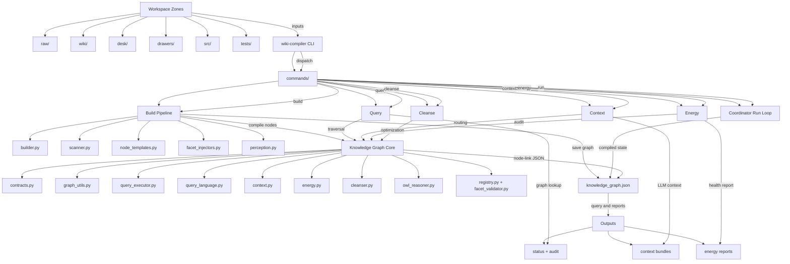

---
identity:
  node_id: "doc:wiki/reference/diagrams/current_system_architecture.md"
  node_type: "reference"
edges:
  - {target_id: "doc:wiki/reference/diagrams/Index.md", relation_type: "implements"}
  - {target_id: "doc:wiki/concepts/how_knowledge_works.md", relation_type: "documents"}
  - {target_id: "file:src/wiki_compiler/main.py", relation_type: "documents"}
  - {target_id: "file:src/wiki_compiler/builder.py", relation_type: "documents"}
  - {target_id: "file:src/wiki_compiler/contracts.py", relation_type: "documents"}
  - {target_id: "file:src/wiki_compiler/graph_utils.py", relation_type: "documents"}
  - {target_id: "file:src/wiki_compiler/query_executor.py", relation_type: "documents"}
  - {target_id: "file:src/wiki_compiler/context.py", relation_type: "documents"}
  - {target_id: "file:src/wiki_compiler/energy.py", relation_type: "documents"}
  - {target_id: "file:knowledge_graph.json", relation_type: "documents"}
compliance:
  status: "implemented"
  failing_standards: []
---

This diagram shows the current architecture of Wikipu before the planned `kgdb` isolation. It treats today's system as one integrated stack: workspace zones feed `wiki-compiler`, `wiki-compiler` builds and queries the graph, and the graph then supports audit, routing, and curation.

## Signature or Schema

Wikipu is currently built as a single repository where the workspace model, CLI orchestration, graph contracts, graph persistence, reasoning helpers, and operational workflows all live under one roof. The CLI entrypoint delegates into command handlers, the build pipeline compiles wiki and source inputs into `knowledge_graph.json`, and the resulting graph supports query, context, energy, audit, and autopoietic workflows.

### Diagram

This diagram is backed by a `spec2viz` source spec at `wiki/reference/diagrams/specs/current_system_architecture.yml`, a rendered Mermaid artifact at `wiki/reference/diagrams/rendered/current_system_architecture.mmd`, and a rendered PlantUML artifact at `wiki/reference/diagrams/rendered/current_system_architecture.puml`.

## Fields

| Layer | Current owner | Main files |
|---|---|---|
| CLI orchestration | `wiki_compiler` | `src/wiki_compiler/main.py`, `src/wiki_compiler/commands/` |
| Build and scan pipeline | `wiki_compiler` | `src/wiki_compiler/builder.py`, `src/wiki_compiler/scanner.py`, `src/wiki_compiler/facet_injectors.py` |
| Graph contracts | `wiki_compiler` | `src/wiki_compiler/contracts.py` |
| Graph persistence and queries | `wiki_compiler` | `src/wiki_compiler/graph_utils.py`, `src/wiki_compiler/query_language.py`, `src/wiki_compiler/query_executor.py` |
| Reasoning and graph reports | `wiki_compiler` | `src/wiki_compiler/context.py`, `src/wiki_compiler/energy.py`, `src/wiki_compiler/cleanser.py`, `src/wiki_compiler/owl_reasoner.py` |
| Workspace curation and operations | `wiki_compiler` + repo zones | `desk/`, `drawers/`, `wiki/`, `src/wiki_compiler/coordinator.py`, `src/wiki_compiler/perception.py` |

| Artifact | Role |
|---|---|
| `raw/` | seed inputs for ingestion and curation |
| `wiki/` | authored truth scanned during build |
| `src/` | code scanned into graph nodes |
| `tests/` | source for test-related facet enrichment |
| `knowledge_graph.json` | compiled graph artifact used by query, context, energy, and cleansing |
| `wiki-compiler` | single CLI entrypoint coordinating the whole stack |

## Usage Examples

- the current system is still monolithic from a library-boundary perspective
- `wiki-compiler` owns both curation concerns and graph concerns
- `knowledge_graph.json` is the main compiled graph artifact
- `wiki/` is one input surface, not the only architectural layer in the running system
- the future `kgdb` split will mainly separate the Graph layer from the CLI/workspace curation layer

- Read this page before discussing `kgdb` extraction so everyone starts from the same picture of the current stack.
- Use it as the parent diagram for later pages like storage boundary, three-library architecture, and post-extraction target state.
