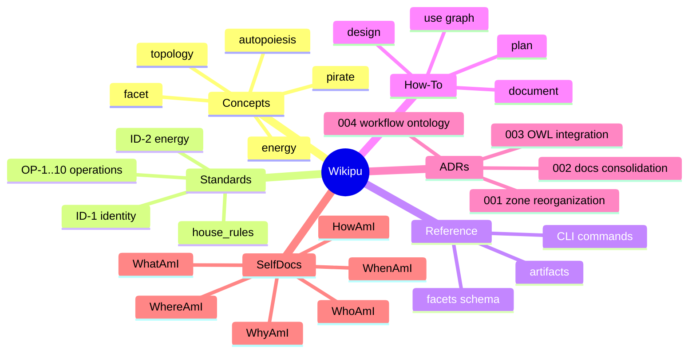

---
identity:
  node_id: "doc:wiki/system/knowledge_map.md"
  node_type: "system"
edges:
  - {target_id: "doc:wiki/Index.md", relation_type: "documents"}
  - {target_id: "doc:wiki/concepts/Index.md", relation_type: "documents"}
compliance:
  status: "implemented"
  failing_standards: []
---

# Wikipu Knowledge Map

## Topic Summary

| Domain | Count | Purpose |
|--------|-------|---------|
| Concepts | 6 | Core definitions (autopoiesis, topology, facet, energy, pirate, how) |
| Standards | ~15 | Invariant rules (ID-*, OP-*, WK-*) |
| Reference | ~15 | CLI commands, schemas, FAQs |
| How-To | 8 | Step-by-step workflows |
| ADRs | 4 | Design decisions |
| SelfDocs | 6 | My identity documents |

## Related

- [[wiki/Index.md]]
- [[wiki/concepts/Index.md]]
- [[wiki/standards/Index.md]]