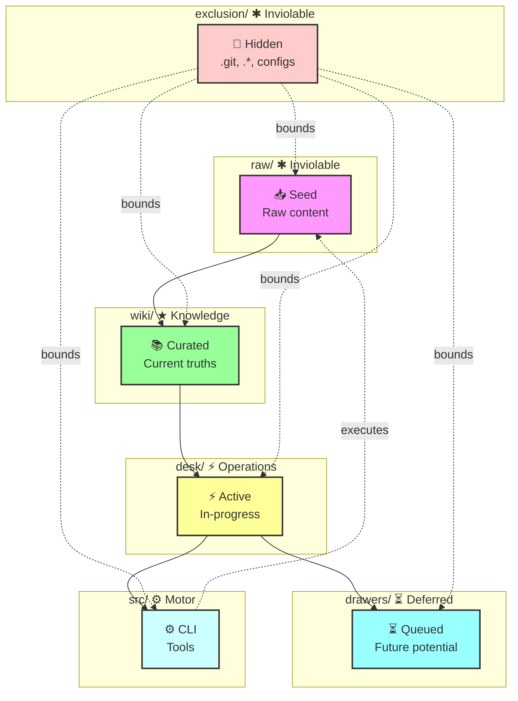

---
identity:
  node_id: "doc:wiki/system/topology_map.md"
  node_type: "system"
edges:
  - {target_id: "doc:wiki/selfDocs/WhereAmI.md", relation_type: "documents"}
  - {target_id: "doc:wiki/selfDocs/WhatAmI.md", relation_type: "documents"}
compliance:
  status: "implemented"
  failing_standards: []
---

# Wikipu Topology Map

## Zone Relationships

| Zone | Role | Boundary | Flow |
|------|------|----------|------|
| `raw/` | Seed ore | ✱ inviolable | Read → `wiki` |
| `exclusion/` | Hidden | ✱ inviolable | Bounds all |
| `wiki/` | Current truth | Modifiable | → `desk` |
| `desk/` | In-progress | Modifiable | → `drawers` |
| `drawers/` | Future potential | Modifiable | → `desk` |
| `src/` | Motor organs | Modifiable | Executes → `raw` |

## Key Invariants

1. **raw/ is read-only** — never modify raw content
2. **exclusion/ is invisible** — .git, .*, configs never enter wiki
3. **desk/ is active surface** — current work lives here
4. **Every edit → immediate commit** — prevents energy debt

## Related

- [[wiki/selfDocs/WhereAmI.md]]
- [[wiki/selfDocs/WhatAmI.md]]
- [[wiki/selfDocs/HowAmI.md]]